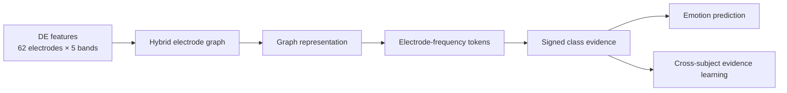
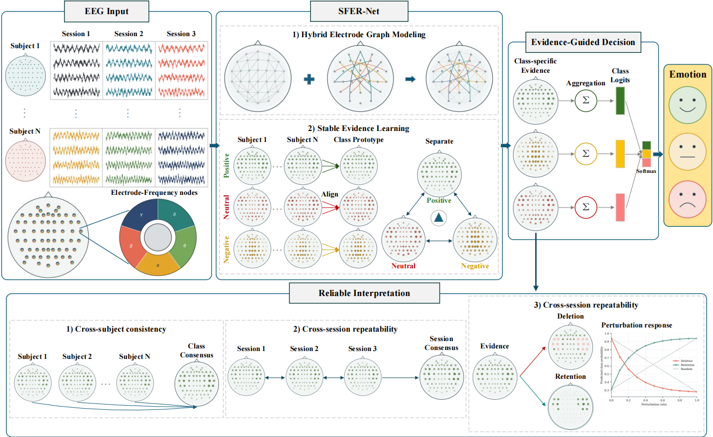

# SFER-Net

**Evidence-Guided Hybrid Graph Learning for Cross-Subject EEG Emotion Recognition**


SFER-Net is an evidence-guided graph neural network for cross-subject EEG
emotion recognition. It combines a geometry-based electrode graph with a
compact learned residual graph and produces signed, class-specific evidence for
every electrode-frequency pair. The same evidence is summed directly into the
classification logits.

## Framework



The complete framework figure should be placed at:

```text
assets/framework.pdf
```

[Open the high-resolution framework figure](assets/framework.pdf)

GitHub displays the Mermaid diagram above directly. If the exact paper figure
should also appear inline, export the first page of the PDF as
`assets/framework.png` and add this line below the PDF link:

```markdown

```

## Main ideas

- **Hybrid electrode graph:** preserves the spatial electrode prior while a
  rank-12 residual graph learns task-dependent corrections.
- **Electrode-frequency evidence:** each token contributes signed evidence to
  every emotion class.
- **Direct evidence aggregation:** the evidence tensor is summed into class
  logits instead of being used only as a post-hoc visualization.
- **Cross-subject learning:** episodic optimal transport aligns same-class
  evidence between support and pseudo-unseen subjects.
- **Retention and deletion:** ranked evidence is evaluated through its effect
  on the model prediction.

## Repository structure

```text
SFER-Net/
├── README.md
├── SFER_Net.py
├── assets/
│   └── framework.pdf  
└── comparison_models/
    ├── DGCNN.py
    ├── RGNN.py
    ├── R2G_STNN.py
    ├── DGGN.py
    ├── BiDANN.py
    ├── DANN_MAT.py
    ├── ADANN.py
    ├── SEDA_EEG.py
    ├── DCGNN.py
    ├── MMASE_DG.py
    ├── SSAS.py
    ├── STS_ML.py
    └── PCL_TDGCN.py
```

## Requirements

Only the network definitions are included in this repository.

```bash
pip install numpy torch
```

The expected model input is a normalized DE tensor with shape:

```text
[batch_size, 62 electrodes, 5 frequency bands]
```

Use `num_classes=3` for SEED and `num_classes=4` for SEED-IV.

## Using SFER-Net

```python
import torch
from SFER_Net import SFERConfig, SFERNet

model = SFERNet(SFERConfig(num_classes=3))
x = torch.randn(8, 62, 5)
output = model(x)

logits = output["logits"]        # [8, 3]
evidence = output["evidence"]    # [8, 3, 62, 5]
prediction = logits.argmax(dim=1)
```

The evidence tensor follows
`[sample, class, electrode, frequency_band]`. Positive and negative values
increase or decrease the corresponding class logit, respectively.

## Using a comparison model

All comparison files use the same `[batch, 62, 5]` input and return a dictionary
containing at least `logits` and `embedding`.

```python
import torch
from comparison_models.DGCNN import DGCNN

model = DGCNN(num_classes=3)
output = model(torch.randn(8, 62, 5))
logits = output["logits"]
```

Domain-adversarial models additionally return `domain_logits`. Their gradient
reversal strength can be supplied through `grl_scale`:

```python
output = model(x, grl_scale=0.5)
```

## Included comparison networks

| Model | Main component | Code |
|---|---|---|
| DGCNN | Learned global graph | [`DGCNN.py`](comparison_models/DGCNN.py) |
| RGNN | Topology-regularized graph and domain loss | [`RGNN.py`](comparison_models/RGNN.py) |
| R2G-STNN | Regional-to-global recurrent fusion | [`R2G_STNN.py`](comparison_models/R2G_STNN.py) |
| DGGN | Sample-dependent graph generation | [`DGGN.py`](comparison_models/DGGN.py) |
| BiDANN | Bilateral domain-adversarial learning | [`BiDANN.py`](comparison_models/BiDANN.py) |
| DANN-MAT | Multiple adversarial domain heads | [`DANN_MAT.py`](comparison_models/DANN_MAT.py) |
| ADANN | Adversarial prototype learning | [`ADANN.py`](comparison_models/ADANN.py) |
| SEDA-EEG | Semi-supervised domain adaptation | [`SEDA_EEG.py`](comparison_models/SEDA_EEG.py) |
| DCGNN | Directed connectivity graph | [`DCGNN.py`](comparison_models/DCGNN.py) |
| MMASE-DG | Spatial, spectral, and global views | [`MMASE_DG.py`](comparison_models/MMASE_DG.py) |
| SSAS | Source selection and adversarial learning | [`SSAS.py`](comparison_models/SSAS.py) |
| STS-ML | Transformer and soft-mask learning | [`STS_ML.py`](comparison_models/STS_ML.py) |
| PCL-TDGCN | Bandwise dynamic graphs and prototypes | [`PCL_TDGCN.py`](comparison_models/PCL_TDGCN.py) |

The comparison files are compact reference implementations under a unified
input/output interface. They are not replacements for the original authors'
official repositories when exact reproduction is required.

## Reported results

| Dataset | Window-level ACC | Trial-level ACC |
|---|---:|---:|
| SEED | 86.65% | 90.96% |
| SEED-IV | 72.75% | 70.83% |

The paper uses session-wise leave-one-subject-out evaluation. Dataset files and
trained checkpoints are not included in this model-definition repository.

## Citation

Please cite the associated SFER-Net paper if this code is useful. The final
bibliographic information can be added here after publication.

```bibtex
@article{SFERNet,
  title   = {SFER-Net: Evidence-Guided Hybrid Graph Learning for Cross-Subject EEG Emotion Recognition},
  journal = {Expert Systems with Applications},
  year    = {To appear}
}
```
